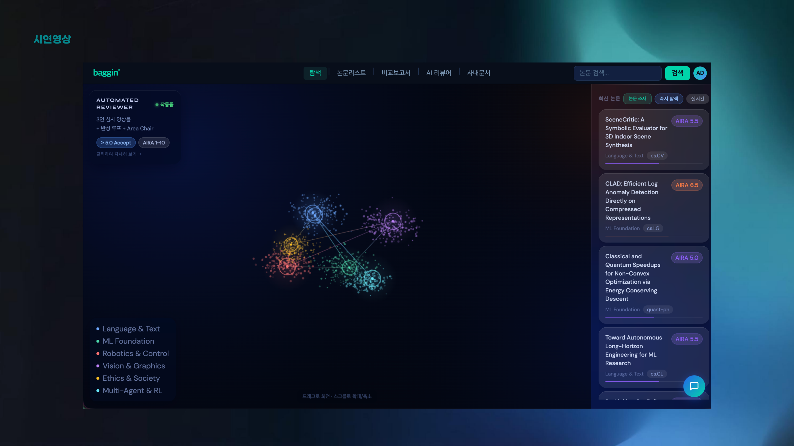
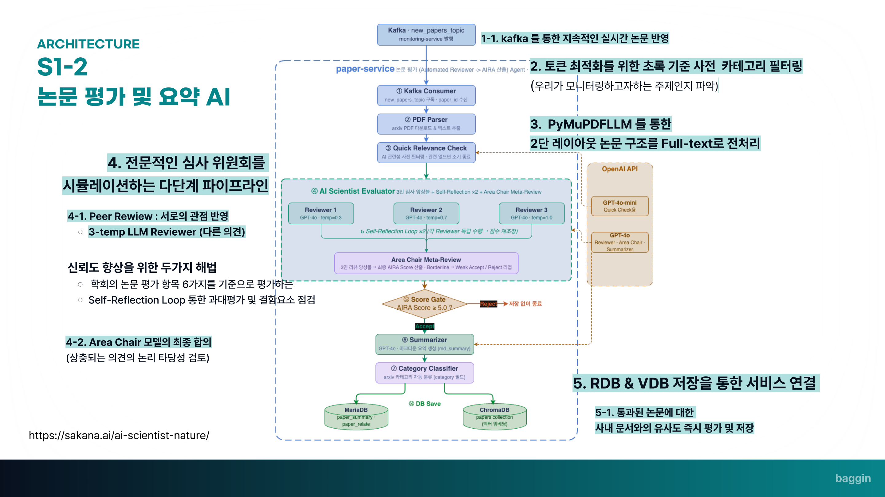
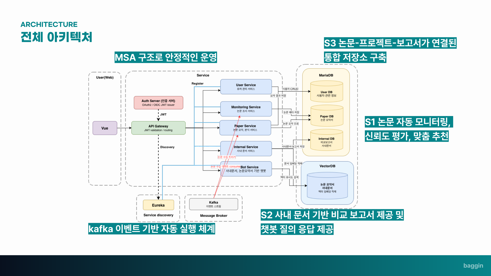

# BAEGIN — Paper Monitoring Platform

**자율 논문 리서치 · 업무 적용 보고서 생성 AI Agent.** 논문을 자동 수집·평가·요약하고, 사내 문서와 비교해 "이 기술을 우리 업무에 어떻게 적용할지" 보고서까지 생성하는 마이크로서비스 플랫폼입니다.

> 본 레포는 팀 프로젝트([yuvnn/BAEGIN](https://github.com/yuvnn/BAEGIN))의 **개인 fork**이며, 아래 커밋 기여 수치는 전체 프로젝트 기준입니다.



## 왜 만들었나

- 하루에 새로 올라오는 논문은 약 **14,000편** (Booketic, 2026)
- 논문 1편을 검토하는 데 평균 약 **5시간** (Publons Global State of Peer Review Report)
- 하루치 논문을 전부 검토하려면 약 **70,000시간** (MDPI Peer Review Study) — 사람이 트래킹하는 것은 물리적으로 불가능합니다.

그래서 baggin'은 세 가지 문제를 각각 파이프라인으로 풀었습니다.

| Painpoint | Solution |
|---|---|
| P1. 검토할 논문의 우선순위를 정하기 어려움 | **S1.** 논문 자동 모니터링 → LLM 리뷰어 앙상블 신뢰도 평가 → 맞춤 추천 |
| P2. 논문과 실제 업무의 연결이 어려움 | **S2.** 사내 문서 기반 비교 보고서 생성 + 챗봇 질의응답 |
| P3. 논문 리서치 결과가 조직 내에서 소멸 | **S3.** 논문–프로젝트–보고서가 연결된 통합 저장소 (MariaDB + ChromaDB) |

기존 도구와의 포지셔닝:

| | Sakana AI (The AI Scientist) | ChatGPT | **baggin'** |
|---|:---:|:---:|:---:|
| 논문 요약 | X | O | **O** |
| 논문 평가 | O | △ | **O** |
| 논문 자동 수집 | X | X | **O** |
| 실무 적용 추천 | X | X | **O** |

---

## 담당 역할 (커밋 실증)

4인 팀 프로젝트입니다. 제(김주환, [@jkwltx177](https://github.com/jkwltx177)) 담당은 커밋 이력으로 확인할 수 있습니다 — 프로젝트 기간(~2026-04-15) 기준 **총 47 / 90 커밋(팀 내 최다)**, 계정 `kimjuhwan` + `jkwltx177`.

- **논문 평가 파이프라인 (`paper-service`, 18/26 커밋)** — The AI Scientist 방식 리뷰어 앙상블 평가(`evaluator`)·요약(`summarizer`)·Kafka consumer·PDF 파서 구현 (`d13c565`, `f51eedd`). 저비용 사전 필터(gpt-4o-mini desk rejection)와 MariaDB 중복 차단을 본평가 앞단에 배치해 논문당 LLM 호출 수를 억제 — 도입 커밋(`7cf675e`) 시점 실측 기준 평가 API 비용 약 30% 절감
- **챗봇 서비스 단독 개발 (`chatbot-service`, 3/3 커밋)** — 사내 문서·논문 요약서 기반 질의응답 챗봇
- **The AI Scientist 평가 코드 리서치 문서 단독 작성** — Sakana AI `perform_review.py` 분석 ([docs/ai-scientist.md](docs/ai-scientist.md), `f51eedd`)

인증·게이트웨이·서비스 디스커버리 등 Spring 계열 인프라와 모니터링·사내 문서 비교 기능은 팀 동료들이 담당했습니다.

---

## 핵심: 논문 평가·요약 파이프라인 (paper-service, 담당 파트)

Nature에 게재된 Sakana AI **The AI Scientist**의 자동 리뷰어 구조를 이식해, "전문 심사 위원회"를 시뮬레이션하는 다단계 평가 파이프라인을 구현했습니다.



```
Kafka new_papers_topic (monitoring-service 발행)
  │
  ▼
① Kafka Consumer        paper_id 수신
② PDF Parser            arXiv PDF 다운로드 → PyMuPDF4LLM 기반 2단 레이아웃 full-text 추출
③ Quick Relevance Check gpt-4o-mini 저비용 사전 필터 — 관심 주제가 아니면 조기 종료 (토큰 최적화)
  │
  ▼
④ AI Scientist Evaluator
   ├─ Reviewer 1 (GPT-4o, temperature 0.3)  ┐
   ├─ Reviewer 2 (GPT-4o, temperature 0.7)  ├─ 3-temp 리뷰어 앙상블 (서로 다른 관점)
   ├─ Reviewer 3 (GPT-4o, temperature 1.0)  ┘
   ├─ Self-Reflection Loop ×2 — 각 리뷰어가 독립적으로 과대평가·결함 요소를 점검하고 점수 재조정
   └─ Area Chair Meta-Review — 3인 리뷰 앙상블로 최종 AIRA Score(1–10) 산출,
                               Borderline은 Weak Accept / Reject로 리맵 (LLM-as-a-judge)
  │
  ▼
⑤ Score Gate            AIRA Score ≥ 5.0 → Accept / 미만은 저장 없이 종료
⑥ Summarizer            GPT-4o 마크다운 요약 생성 (md_summary)
⑦ Category Classifier   arXiv 카테고리 자동 분류
⑧ DB Save               MariaDB(paper_summary·paper_relate) + ChromaDB(papers collection 벡터 임베딩)
```

설계 포인트:

- **신뢰도**: 학회 논문 심사 항목 6가지를 기준으로 평가하고, temperature가 다른 3인 리뷰어의 상호 이견을 Area Chair가 합의시키는 구조로 단일 LLM 평가의 편향을 완화
- **비용**: 본평가(GPT-4o ×3 + Self-Reflection ×2)는 비싸므로, gpt-4o-mini 사전 관련성 필터와 DB 중복 차단을 앞단에 배치해 불필요한 본평가 호출을 차단
- **품질 게이트**: AIRA Score 5.0 미만 논문은 저장 자체를 하지 않아 다운스트림(요약·벡터 적재·추천)의 품질을 보장

### 주변 파이프라인 (팀 동료 담당)

- **논문 수집 (monitoring-service)** — 스케줄러(180분 주기)가 arXiv·HuggingFace API에서 신규 논문을 수집하고, 중복 제거 → 메타데이터 필터(학회·카테고리) → Semantic Scholar 기반 정량 필터(저자 권위·인용) → GPT-4o + Tavily Search 임팩트 스코어링 → 카테고리 다양성 쿼터를 거쳐 Kafka로 발행합니다.
- **비교 보고서 생성 (internal-service)** — 기획서 요구사항 정리와 논문 핵심 기술 요약을 병렬 수행한 뒤 요구사항↔기술 매핑을 분석하고(Stage 1), 도입 후보 정리 → 도입 방식 설계 → 기대효과·리스크 도출 → 종합 결론까지 8개 태스크(T1–T8)를 거쳐 ChromaDB RAG 기반 비교 보고서를 생성합니다.

---

## 실행 방법

### 1. 환경 변수 준비

프로젝트 루트의 `.env` 파일에 아래 값을 설정합니다.

```env
# JWT 서명 키 (32자 이상)
JWT_SECRET=your-secret-key-at-least-32-characters

# LLM API
OPENAI_API_KEY=sk-...
ANTHROPIC_API_KEY=sk-ant-...

# Slack 알림 (선택)
SLACK_BOT_TOKEN=xoxb-...
SLACK_CHANNEL_ID=C...

# Semantic Scholar API (선택 — 없으면 rate limit 적용)
SEMANTIC_SCHOLAR_API_KEY=...
```

### 2. 실행

```bash
# 전체 서비스 빌드 및 기동
docker compose up --build -d

# 로그 확인
docker compose logs -f

# 종료
docker compose down
```

### 3. 기동 확인

서비스가 모두 뜨는 데 약 90초가 소요됩니다 (Eureka 헬스체크 대기).

| 확인 항목 | URL |
|-----------|-----|
| **프론트엔드** | http://localhost:15173 |
| **Eureka 대시보드** (서비스 등록 현황) | http://localhost:18761 |
| **API Gateway** | http://localhost:18080 |
| Auth Swagger | http://localhost:18081/swagger-ui/index.html |
| User Swagger | http://localhost:18082/docs |
| Paper Swagger | http://localhost:18083/docs |
| Internal Swagger | http://localhost:18084/docs |
| Monitoring Swagger | http://localhost:18085/docs |
| Chatbot Swagger | http://localhost:18086/docs |
| ChromaDB | http://localhost:18090 |

```bash
# 헬스체크 빠른 확인
docker compose ps
curl http://localhost:18082/health
curl http://localhost:18083/health
curl http://localhost:18085/health
```

### 4. 사내 문서 등록

비교 보고서 기능을 사용하려면 PDF 파일을 `data/internal_docs/` 디렉터리에 넣고 서비스를 기동합니다.

```bash
mkdir -p data/internal_docs
cp your-document.pdf data/internal_docs/
docker compose up --build -d
```

---

## 전체 아키텍처



```
Browser
  │
  └─ Nginx (vue-project:80)
       ├─ /api/*        → api-gateway:8080  (Spring Cloud Gateway)
       │                      │
       │          ┌───────────┼───────────────┐
       │          ▼           ▼               ▼
       │     auth-server  user-service   paper-service  monitoring-service
       │     (Spring Boot) (FastAPI)     (FastAPI)      (FastAPI)
       │
       └─ /internal-api/* → internal-service:8000 (FastAPI, direct)
```

### 서비스 디스커버리 (Spring Cloud Eureka)

```
eureka-server (8761)
  ├── api-gateway       등록 O
  ├── auth-server       등록 O
  ├── user-service      등록 O
  ├── paper-service     등록 O
  ├── monitoring-service 등록 O
  ├── internal-service  등록 X (직접 호출)
  └── chatbot-service   등록 X (직접 호출)
```

Gateway는 `lb://서비스명` 방식으로 Eureka를 통해 부하분산합니다.

### 메시지 흐름 (Kafka)

```
monitoring-service
  └─ [Kafka] new_papers_topic ──→ paper-service (consumer)
```

monitoring-service가 수집한 논문을 Kafka로 발행하면, paper-service가 소비해 MariaDB + ChromaDB에 저장합니다. 수집→평가→저장이 이벤트 기반으로 자동 실행됩니다.

### 서비스간 HTTP 호출

```
monitoring-service ──→ internal-service  /ingest/paper   (논문 텍스트 적재)
monitoring-service ──→ paper-service     /papers/{id}    (논문 상세 조회, 간접)
```

---

## 서비스 구조

```
BAEGIN/
├── docker-compose.yml
├── .env                        # 환경 변수 (gitignore)
├── data/
│   ├── internal_docs/          # 사내 문서 PDF 마운트 경로
│   ├── reports/                # 생성된 보고서 저장
│   ├── chroma/                 # ChromaDB 영속 데이터
│   └── kafka/                  # Kafka 로그 데이터
│
├── eureka-server/              # [Spring Boot] 서비스 레지스트리 (port 8761)
├── api-gateway/                # [Spring Boot] 라우팅 + JWT 검증 (port 8080)
├── auth-server/                # [Spring Boot] 로그인/회원가입/OTP (port 8080→18081)
│
├── user-service/               # [FastAPI] 사용자 프로필·키워드 관리 (port 8000→18082)
├── paper-service/              # [FastAPI] 논문 평가·요약·벡터DB 적재 (port 8000→18083)
├── internal-service/           # [FastAPI] 사내 문서 비교 보고서 생성 (port 8000→18084)
├── monitoring-service/         # [FastAPI] 논문 수집·필터링·스코어링 (port 8000→18085)
├── chatbot-service/            # [FastAPI] 논문 추천 챗봇 (port 8000→18086)
│
└── vue-project/                # [Vue 3 + Nginx] 프론트엔드 (port 80→15173)
```

### 포트 정리

| 서비스 | 컨테이너 포트 | 호스트 포트 |
|--------|:---:|:---:|
| eureka-server | 8761 | 18761 |
| api-gateway | 8080 | 18080 |
| auth-server | 8080 | 18081 |
| user-service | 8000 | 18082 |
| paper-service | 8000 | 18083 |
| internal-service | 8000 | 18084 |
| monitoring-service | 8000 | 18085 |
| chatbot-service | 8000 | 18086 |
| chromadb | 8000 | 18090 |
| mariadb | 3306 | 3306 |
| kafka | 9092 | 19092 |
| vue-project (nginx) | 80 | 15173 |

---

## 핵심 데이터 흐름

1. `monitoring-service`가 arXiv·HuggingFace에서 논문을 수집하고 임팩트 스코어 기반으로 필터링합니다.
2. 통과한 논문을 Kafka(`new_papers_topic`)로 발행하고, `internal-service`에 텍스트 적재를 요청합니다.
3. `paper-service`가 Kafka 메시지를 소비해 리뷰어 앙상블 평가(AIRA Score ≥ 5.0 게이트)를 거친 논문만 요약과 함께 MariaDB·ChromaDB에 저장합니다.
4. 사용자가 프론트엔드에서 논문 요약 또는 사내 문서 비교 보고서를 요청합니다.
5. `internal-service`가 ChromaDB RAG 기반으로 비교 보고서를 스트리밍으로 응답하고, `chatbot-service`가 논문·사내 문서 질의응답을 제공합니다.

---

## 기술 스택

| 분류 | 기술 |
|------|------|
| 서비스 디스커버리 | Spring Cloud Netflix Eureka |
| API Gateway | Spring Cloud Gateway (WebFlux) |
| 인증 | JWT (JJWT), Spring Security OAuth2 Resource Server |
| 백엔드 (Java) | Spring Boot 3.4.5, Spring Cloud 2024.0.0 |
| 백엔드 (Python) | FastAPI, SQLAlchemy, py-eureka-client |
| 프론트엔드 | Vue 3, Nginx |
| 벡터DB | ChromaDB |
| 관계형DB | MariaDB 10.11 |
| 메시지 큐 | Apache Kafka (KRaft mode) |
| LLM | OpenAI GPT-4o (리뷰어 앙상블·Area Chair·요약), gpt-4o-mini (사전 관련성 필터), Anthropic Claude |
| 외부 API | arXiv API, HuggingFace API, Semantic Scholar API, Tavily Search |
| PDF 처리 | PyMuPDF4LLM (2단 레이아웃 논문 full-text 추출) |
